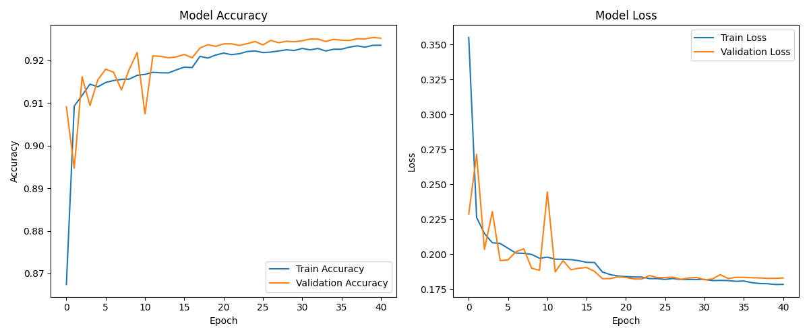
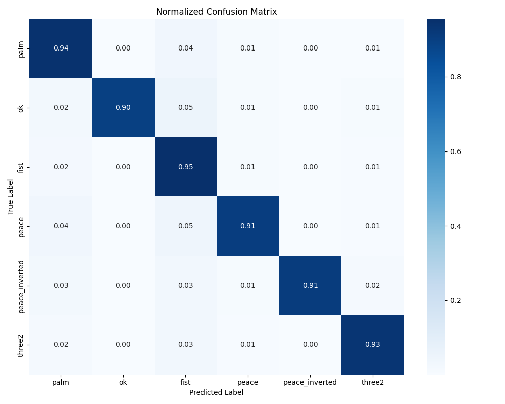
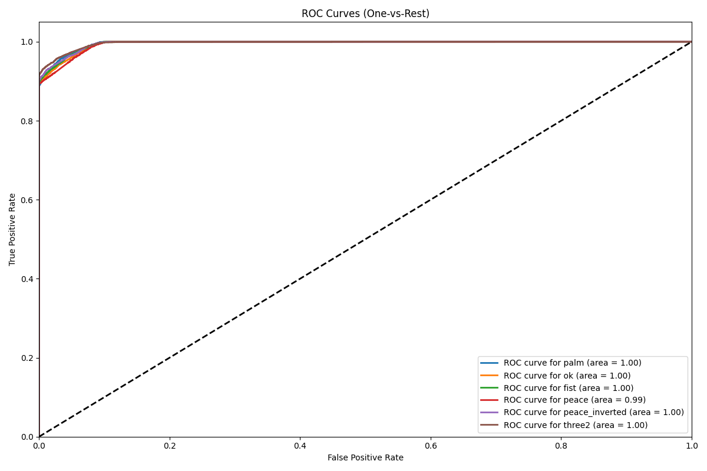
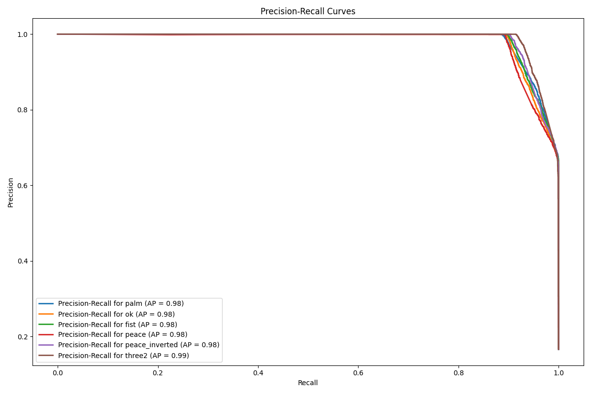

# Gesture Controlled Virtual Mouse

A real-time virtual mouse system that leverages computer vision and deep learning to recognize hand gestures from webcam input and translate them into mouse control operations.

## Features

- Real-time hand gesture recognition
- Mouse movement control using palm gesture
- Left click using 'OK' gesture
- Right click using 'Three' gesture
- Scroll up/down using peace/peace inverted gestures
- Smooth cursor movement with position interpolation
- Visual feedback of current action
- Support for multiple hand gestures:
  - Palm (Mouse Movement)
  - OK (Left Click)
  - Three (Right Click)
  - Peace (Scroll Up)
  - Peace Inverted (Scroll Down)
  - Fist (Stop Scrolling)

## Requirements

The project requires the following dependencies:
- Python 3.x
- OpenCV
- MediaPipe
- TensorFlow
- NumPy
- PyAutoGUI

You can install all dependencies using the provided environment.yml file:
```bash
conda env create -f environment.yml
```

## Installation

1. Clone the repository:
```bash
git clone [your-repository-url]
cd [repository-name]
```

2. Create and activate the conda environment:
```bash
conda env create -f environment.yml
conda activate [environment-name]
```

3. Pre-trained model and datasets:

- The pre-trained model (model.h5) is included in this repository.
- The datasets are too large to host on GitHub.
- Download them from Google Drive and place them in a folder named datasets/ in the project root.
Datasets: https://drive.google.com/drive/folders/1x3Eq0ZM-OMumPrfos8DCGbFoBRw6R-by?usp=sharing

## Usage

Run the main script:
```bash
python gesture_mouse.py
```

### Controls
- Show your palm to move the cursor
- Make an 'OK' gesture to perform a left click
- Show three fingers to perform a right click
- Make a peace sign to scroll up
- Make an inverted peace sign to scroll down
- Make a fist to stop scrolling
- Press 'q' to quit the application

## Model Performance

The model has been trained and evaluated on a diverse dataset of hand gestures. Here are the performance metrics:

### Training History


### Confusion Matrix


### ROC Curves


### Precision-Recall Curves


### Class-wise Metrics


## Project Structure

```
├── gesture_mouse.py      # Main application code
├── model.h5             # Pre-trained model
├── environment.yml      # Conda environment configuration
└── test_reports/       # Model evaluation metrics and graphs
    ├── model_metrics.json
    ├── model_summary.txt
    ├── training_history.png
    ├── confusion_matrix.png
    ├── roc_curves.png
    ├── precision_recall_curves.png
    └── class_metrics.png
```

## Acknowledgments

- MediaPipe for hand tracking capabilities
- TensorFlow for deep learning framework
- OpenCV for computer vision operations 